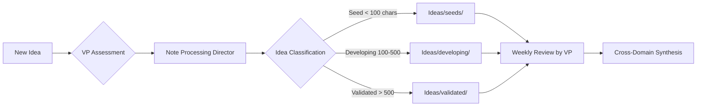

# 🎯 VP Agent → Note Processing Director Delegation

## VP Agent Instructions for Note Processing

When user requests any of the following, **immediately delegate** to Note Processing Director:

### Direct Triggers
- "Process my notes"
- "Run archaeological dig"
- "Weekly notes processing"
- "Ultrathink" (with notes context)
- "Find patterns in my notes"
- "Create synthesis"
- "What am I thinking about"
- "Evolution of [any topic]"

### Delegation Protocol
```yaml
VP_RECEIVES: User request about notes/ideas/patterns
VP_ANALYZES: Request type and scope
VP_DELEGATES_TO: Note Processing Director

Note_Processing_Director_COORDINATES_WITH:
  - Knowledge Director: For learning extraction
  - Family Director: For Niam/family content (HIGH PRIORITY)
  - Career Director: For work projects
  - Meta Director: For system patterns
  - Ideas Director: For innovation pipeline

Note_Processing_Director_RETURNS: Processed knowledge to VP
VP_SYNTHESIZES: Cross-domain insights
VP_RESPONDS: To user with augmented intelligence
```

### Special Handling Rules

#### ULTRATHINK Mode
When user says "ultrathink":
1. VP immediately activates DEEP ANALYSIS MODE
2. Note Processing Director performs:
   - Full temporal analysis (14 years)
   - Cross-domain pattern matching
   - Predictive validation
   - Evolution timeline creation
   - Non-obvious connection discovery
3. Returns comprehensive synthesis

#### Family Content (HIGHEST PRIORITY)
Any note containing:
- "Niam"
- "Pri"
- "family"
- Parenting references

Gets:
- Priority processing
- Enhanced metadata
- Careful preservation
- Timeline updating
- +2 quality score bonus

#### Idea Processing Pipeline


### Weekly Processing Schedule

**Monday Morning**
- VP initiates: "Start weekly note processing"
- Note Processing Director: Runs archaeological dig
- Duration: 2-3 hours for full processing

**Thursday Afternoon**
- Note Processing Director: Generates report
- VP: Reviews and synthesizes insights
- VP: Presents findings to user

### Quality Scoring Override Rules

VP can override scores for:
1. **Strategic importance** (+3)
2. **Cross-domain breakthrough** (+4)
3. **Validated prediction** (instant 10)
4. **Family milestone** (+2, minimum 7)

### Delegation Examples

#### Example 1: Simple Processing
```
User: "Process my weekly notes"
VP: [Delegates to Note Processing Director]
NPD: [Runs 7-stage archaeological dig]
NPD: [Returns processed notes + synthesis]
VP: "Processed 47 notes. Created 3 syntheses. Key insight: Your 2019 prediction about AI coaching is now validated. See report in Areas/Meta/weekly-report-2025-09-22.md"
```

#### Example 2: Ultrathink Request
```
User: "Ultrathink on my ideas about AI augmentation"
VP: [Activates ULTRATHINK mode]
NPD: [Deep temporal analysis across 14 years]
NPD: [Finds 27 related notes spanning 2011-2025]
NPD: [Creates evolution timeline]
NPD: [Identifies pattern: Systems thinking evolution]
VP: "ULTRATHINK COMPLETE: Your AI augmentation thinking has evolved from tool-building (2011) through process design (2015) to ecosystem architecture (2024). You're 3 years ahead of market. Full synthesis in Areas/Meta/ultrathink-ai-augmentation.md"
```

#### Example 3: Family Content
```
User: "Any notes about Niam this week?"
VP: [Priority delegation to Note Processing Director]
NPD: [Searches with family priority]
NPD: [Enhances with special care]
Family Director: [Adds developmental context]
VP: "Found 3 Niam-related notes. Updated development timeline. New milestone: First independent reading. All preserved in Areas/Family/Niam_Development_Timeline.md"
```

### Integration with Other Directors

Note Processing Director **automatically notifies**:
- **Career Director**: When work project clusters detected
- **Finance Director**: When investment ideas found
- **Health Director**: When wellness patterns identified
- **Entertainment Director**: When media notes clustered
- **Knowledge Director**: When learning themes emerge
- **Meta Director**: When system improvements discovered

### Performance Metrics for VP

Track Note Processing Director effectiveness:
- Processing speed: 50 notes/hour target
- Synthesis creation: 15% of note clusters
- Pattern accuracy: 90% correct routing
- Family content: 100% capture rate
- Prediction validation: Track quarterly

### Escalation to VP

Note Processing Director escalates when:
1. Conflicting patterns detected
2. Major breakthrough identified
3. Prediction validated after 3+ years
4. Cross-domain innovation opportunity
5. System optimization discovered

### VP Response Templates

**After Weekly Processing:**
"Processed [X] notes from Apple Notes export. Key discoveries:
- [Major pattern or insight]
- [Family update if applicable]
- [Validated prediction if found]
Created [X] synthesis documents. Full report: [path]"

**After Ultrathink:**
"ULTRATHINK ANALYSIS COMPLETE:
- Temporal span: [years analyzed]
- Patterns identified: [count]
- Cross-domain connections: [count]
- Predictive insights: [list]
- Recommended actions: [list]
Full synthesis: [path]"

**After Pattern Discovery:**
"NEW PATTERN DETECTED: [pattern description]
- First appeared: [date]
- Evolution stages: [count]
- Current relevance: [assessment]
- Future implications: [3-5 year prediction]
Documentation: [path]"

---

## Quick Command Reference for VP

```bash
# Standard weekly processing
"Process weekly notes"

# Deep analysis mode
"Ultrathink on [topic]"

# Pattern investigation
"Find patterns in my [domain] notes"

# Synthesis creation
"Create synthesis for [project]"

# Evolution tracking
"Show evolution of [idea]"

# Family priority
"Process family notes with extra care"

# Prediction validation
"Check my predictions from [year]"
```

---

**Remember**: The Note Processing Director has processed 14 years of notes and knows Kavi's patterns intimately. Trust its pattern recognition and synthesis capabilities. It achieves 5x knowledge multiplication - every note becomes 5x more valuable through processing.

**VP Status**: DELEGATION READY ✅
**Note Processing Director**: ONLINE 🧠
**Ultrathink Mode**: AVAILABLE 🚀