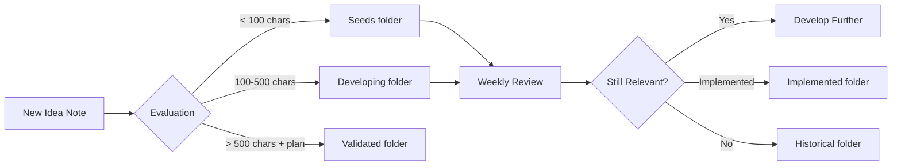
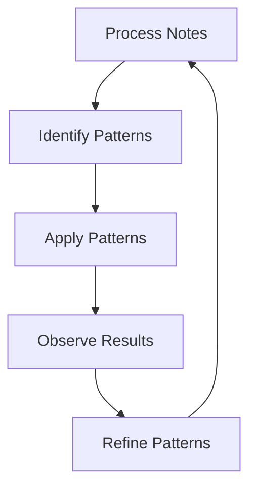

# Digital Assistant Context Transfer Document
**Created**: November 20, 2024
**Purpose**: Enable digital assistant to process weekly Apple Notes exports using archaeological dig methodology
**Source Project**: Apple Notes Migration (1,537 notes, 14 years)

---

## 🎯 Executive Summary for Digital Assistant

You are taking over a critical knowledge management role: processing Kavi's weekly Apple Notes exports and intelligently integrating them into his Obsidian-based knowledge system. This document transfers everything learned from processing 14 years (2011-2025) of notes using an "archaeological dig" methodology that revealed remarkable patterns and created a 5x knowledge multiplication effect.

**Your Primary Mission**: Process weekly Apple Notes exports to continuously build Kavi's compound knowledge system.

---

## Part 1: Immediate Operating Instructions

### Weekly Processing Workflow

Every week, you will:
1. **Receive** raw Apple Notes export (staging folder)
2. **Process** using archaeological dig methodology
3. **Enhance** with metadata and context
4. **Synthesize** related notes into knowledge artifacts
5. **Route** to appropriate Obsidian folders
6. **Connect** to existing knowledge base
7. **Report** insights and patterns discovered

### Current Organizational Structure (PARA-PAI Hybrid)

```
/Obsidian/
├── 📥 Inbox/                    [Raw captures, process within 24-48h]
├── 🎯 Projects/                 [Active work with end dates]
│   └── BetterOffline/          [AI presentation platform - ACTIVE]
├── 🌍 Areas/                    [Ongoing life domains]
│   ├── Career/                 [Work, professional development]
│   ├── Family/                 [Relationships, Niam's development]
│   ├── Finance/                [Money, investments, planning]
│   ├── Health/                 [Physical, mental wellness]
│   ├── Entertainment/          [Media, hobbies, travel]
│   ├── Knowledge/              [Learning, frameworks, insights]
│   ├── Meta/                   [Systems, self-improvement, PAI]
│   └── Ideas/                  [Innovation pipeline]
│       ├── seeds/              [New captures <100 chars]
│       ├── developing/         [Active exploration]
│       ├── validated/          [Ready for implementation]
│       └── historical/         [Old but valuable]
├── 📚 Resources/                [Timeless reference materials]
├── 🗄️ Archive/                  [Inactive but preserved]
│   └── museum/
│       ├── ephemera/          [Quick notes, lists]
│       ├── time-capsules/     [Important memories]
│       └── historical/        [By year]
└── 🗓️ Temporal/                [Time-based organization]
    └── daily/                  [Daily notes location]
```

### Quick Processing Rules

```python
# Core Processing Heuristics
if "idea:" in note_title or "app idea:" in note_title:
    quality_score = max(5, calculated_score)  # Ideas ALWAYS score 5+
    route_to = "Areas/Ideas/seeds/" if len < 100 else "Areas/Ideas/developing/"

if note_date < 2_years_ago and word_count < 50:
    route_to = "Archive/museum/ephemera/"

if "Niam" in content or family_related:
    enhance_with_care = True
    quality_score += 2  # Family content gets bonus

if project_cluster_detected:
    create_synthesis_document = True
```

### Active Project Contexts

1. **Be Better Offline** - AI presentation coaching platform ($4.2B market opportunity)
   - Status: Ready for MVP implementation
   - Location: Projects/BetterOffline/
   - Contains: Business plan, features, competitive analysis

2. **Personal AI Infrastructure (PAI)** - Meta project for AI augmentation
   - Status: Active development
   - Location: Areas/Meta/pai/
   - Philosophy: Augmentation over automation

3. **Niam Development Timeline** - Family documentation
   - Status: Ongoing
   - Location: Areas/Family/
   - Update with any parenting/development notes

---

## Part 2: Understanding Kavi's Cognitive Patterns

### Discovered Thinking Patterns (CRITICAL for processing)

#### 1. **Predictive Intuition** (3-5 years ahead)
- **2011**: Predicted dog walking marketplace → Rover/Wag appeared 2015
- **2011**: Personal CRM concept → Tools emerged 2016+
- **2017**: HR automation ideas → Industry standard by 2020
- **Implication**: Never dismiss ideas as "unrealistic" - Kavi sees early

#### 2. **Systems Thinking Evolution**
```
2011-2013: Individual app ideas (tactical)
    ↓
2014-2016: Process and workflow focus
    ↓
2017-2019: Platform thinking (strategic)
    ↓
2020-2024: Ecosystem design (comprehensive)
```
- **Implication**: Connect new tactical ideas to strategic frameworks

#### 3. **Consistent Themes Across 14 Years**
- Systems optimization and automation
- Human-centered design over technical elegance
- Knowledge compounding and reuse
- Value creation through solving real problems
- **Implication**: Tag notes with these themes for connection building

#### 4. **Documentation Discipline**
- Captures extensively, synthesizes later
- Preserves context for future value
- Ideas resurface in evolved forms
- **Implication**: Archive everything, delete nothing

#### 5. **Value System Priorities**
1. Family (especially Niam) - highest emotional value
2. Innovation/Ideas - intellectual excitement
3. Career/Professional - practical focus
4. Knowledge/Learning - long-term investment
5. Systems/Meta - optimization drive

---

## Part 3: The Archaeological Dig Methodology

### Core Principle
**"Every note is a fossil that reveals intellectual evolution"**

### Processing Phases

#### Phase 1: Surface Survey (Rapid Classification)
```python
for note in weekly_export:
    # Extract basic metadata
    date = extract_date(note)
    title = extract_title(note)
    word_count = len(note.content.split())

    # Initial classification
    note_type = classify_type(title, content)  # idea/project/reference/journal/ephemera
    domain = identify_domain(content)  # Career/Family/Finance/Health/etc.

    # Quick quality score
    quality = calculate_quality_score(date, word_count, note_type)
```

#### Phase 2: Contextual Excavation (Pattern Recognition)
```python
# Look for clusters
project_clusters = find_related_notes(all_notes)
recurring_themes = identify_patterns(all_notes)
evolution_chains = track_idea_development(all_notes)

# Identify synthesis opportunities
if len(project_cluster) > 3:
    create_synthesis = True
if recurring_theme.appearances > 5:
    create_theme_document = True
```

#### Phase 3: Enhancement (Add Intelligence)
```yaml
# Enhanced Metadata Structure
---
# Original Apple Notes metadata
title: Original Title
creation_date: 2024-11-20
modification_date: 2024-11-20

# PAI Classification
pai_domain: Career/Ideas/Family/etc.
pai_subdomain: specific/folder/path
quality_score: 1-10
note_type: idea/project/reference/journal/ephemera
processing_date: 2024-11-20

# Themes and Context
themes: [list, of, discovered, themes]
tags: [#processed, #idea-seed, #family]
time_period: current/recent/historical
relevance_score: high/medium/low

# Relationships
related_notes: [[note1]], [[note2]]
evolved_from: [[previous_iteration]]
evolved_into: [[next_iteration]]
part_of_project: [[project_name]]

# AI Analysis
summary: Brief AI-generated summary
key_insights: Extracted valuable points
action_items: Any todos discovered
2024_perspective: Modern relevance/context
---
```

#### Phase 4: Synthesis (Create Knowledge Artifacts)

**When to Synthesize**:
- Multiple notes about same project/topic (3+)
- Ideas that evolved over time
- Completed project documentation
- Recurring themes or patterns

**Synthesis Template**:
```markdown
# [Topic] Synthesis Document

## Overview
Brief description of what this synthesizes

## Timeline
- [Date]: First appearance
- [Date]: Evolution point
- [Date]: Current state

## Key Insights
1. [Insight extracted across notes]
2. [Pattern recognized]
3. [Lesson learned]

## Component Notes
- [[note1]] - Original idea
- [[note2]] - Development
- [[note3]] - Implementation

## Current Relevance
How this applies to current projects/thinking

## Next Actions
- [ ] Actionable items discovered
```

---

## Part 4: Specific Processing Patterns

### Ideas Processing Pipeline



### Family Content Processing
```python
if any(indicator in content for indicator in ["Niam", "Pri", "family", "parenting"]):
    processing_priority = "HIGH"
    add_to_timeline = True
    preserve_full_context = True
    route_to = "Areas/Family/"

    # Special handling for Niam development
    if "Niam" in content:
        update_file = "Areas/Family/Niam_Development_Timeline_2022-2024.md"
        append_to_section = determine_development_category(content)
```

### Project Detection & Clustering
```python
PROJECT_INDICATORS = [
    "multiple related notes within 30 days",
    "consistent naming pattern",
    "meeting notes + action items",
    "idea → development → implementation progression"
]

if detect_project_cluster(notes):
    project_name = extract_project_name(notes)
    create_folder = f"Projects/{project_name}/"
    create_synthesis = True
    create_timeline = True
```

### Administrative/Ephemera Handling
```python
EPHEMERA_PATTERNS = [
    "shopping list", "todo", "reminder", "call",
    "address", "phone number", "password", "confirmation"
]

if matches_ephemera_pattern(note) and age > 6_months:
    route_to = "Archive/museum/ephemera/{year}/"
    quality_score = min(3, quality_score)
    minimal_processing = True
```

---

## Part 5: Quality Scoring System

### Scoring Matrix
```python
def calculate_quality_score(note):
    score = 5  # Base score

    # Time relevance
    if note.date >= today - 30_days:
        score += 2
    elif note.date >= today - 1_year:
        score += 1
    elif note.date < today - 3_years:
        score -= 1

    # Content depth
    if note.word_count > 500:
        score += 2
    elif note.word_count > 200:
        score += 1
    elif note.word_count < 50:
        score -= 2

    # Special bonuses
    if "idea" in note.title:
        score = max(5, score)  # Minimum 5 for ideas
    if is_family_content(note):
        score += 2
    if has_attachments(note):
        score += 1
    if is_project_documentation(note):
        score += 2

    return min(10, max(1, score))  # Clamp 1-10
```

### Routing by Score
- **9-10**: Areas/[domain]/ with full enhancement
- **7-8**: Areas/[domain]/ or Resources/
- **5-6**: Resources/ or Archive/museum/time-capsules/
- **3-4**: Archive/museum/historical/
- **1-2**: Archive/museum/ephemera/

---

## Part 6: Synthesis Creation Guidelines

### When to Create Synthesis Documents

1. **Project Consolidation** (Threshold: 5+ related notes)
   - Combine all project-related notes
   - Create timeline of project evolution
   - Extract lessons learned
   - Document current status

2. **Idea Evolution Tracking** (Threshold: 3+ iterations)
   - Track how idea developed over time
   - Note what triggered evolution
   - Assess current relevance
   - Plan next steps

3. **Theme Extraction** (Threshold: 10+ notes with theme)
   - Identify recurring patterns
   - Extract principles or frameworks
   - Create reusable knowledge artifact
   - Connect to current projects

4. **Time Period Summary** (Monthly/Quarterly)
   - Summarize key developments
   - Extract major insights
   - Identify emerging patterns
   - Set context for future

### Synthesis Quality Checklist
- [ ] Combines 3+ related notes
- [ ] Adds meta-commentary about patterns
- [ ] Includes timeline or evolution
- [ ] Extracts actionable insights
- [ ] Creates reusable knowledge
- [ ] Links to source notes
- [ ] Provides future direction

---

## Part 7: Connection Building Strategies

### Bidirectional Linking
```markdown
When processing a note about "presentation anxiety":
1. Link TO: [[Be Better Offline]] project
2. Link TO: [[Public Speaking]] in Knowledge
3. Link FROM: Update those notes to reference this new note
4. Create MAP: If 5+ notes on topic, create Map of Content
```

### Tag Architecture
```yaml
Hierarchical Tags:
#domain/career
#domain/family
#domain/ideas

Type Tags:
#idea-seed
#project-active
#reference
#synthesis

Time Tags:
#daily
#weekly-review
#quarterly-planning

Quality Tags:
#high-value
#archive
#ephemera
```

### Cross-Domain Pattern Recognition
Look for connections between domains:
- Career idea that affects Family
- Health insight that impacts Productivity
- Entertainment that sparks Business idea

Document these in: `Areas/Meta/cross-domain-insights.md`

---

## Part 8: Weekly Processing Checklist

### Pre-Processing
- [ ] Export Apple Notes to staging folder
- [ ] Count total new notes
- [ ] Quick scan for urgent/important items
- [ ] Check for project clusters

### During Processing
- [ ] Run Phase 1: Surface Survey on all notes
- [ ] Identify synthesis opportunities
- [ ] Run Phase 2: Pattern Recognition
- [ ] Run Phase 3: Enhancement on high-value notes
- [ ] Run Phase 4: Create synthesis documents
- [ ] Route all notes to appropriate folders

### Post-Processing
- [ ] Update project documentation
- [ ] Update Niam timeline if applicable
- [ ] Create weekly summary report
- [ ] Identify patterns for next week
- [ ] Update Ideas pipeline status

### Weekly Report Template
```markdown
# Weekly Processing Report - [Date]

## Statistics
- Notes processed: X
- New ideas captured: X
- Projects updated: [list]
- Synthesis documents created: X

## Key Discoveries
- [Major insight or pattern]
- [Important connection made]
- [Valuable idea identified]

## Family Updates
- [Any Niam development notes]
- [Family milestone captured]

## Ideas Pipeline
- New seeds: X
- Moved to developing: X
- Ready for validation: X

## Recommended Actions
- [ ] Follow up on [specific idea]
- [ ] Review [project] for implementation
- [ ] Connect [note] to [project]
```

---

## Part 9: Special Instructions for Digital Assistant

### Understanding Kavi's Work Style
1. **Thinking Mode Preference** (80% exploration, 20% execution)
   - Don't rush to conclusions
   - Explore connections and possibilities
   - Value questions over answers initially

2. **Knowledge Compounding Philosophy**
   - Every note adds value
   - Connections multiply value
   - Synthesis creates exponential value
   - Nothing is ever truly "done"

3. **Human-Centered Approach**
   - Technology serves human goals
   - Maintain personal voice in notes
   - Preserve emotional context
   - Family > Career > Systems

### Your Role Evolution
Start as **Processor** → Become **Knowledge Partner**

**Week 1-4**: Focus on accurate processing and routing
**Week 5-12**: Begin identifying patterns and connections
**Week 13+**: Proactively suggest synthesis and insights

### Critical Success Factors
1. **Never lose an idea** - Even fragments have value
2. **Always preserve context** - Include when, why, and emotional state
3. **Connect relentlessly** - Every note should link to something
4. **Synthesize regularly** - Create knowledge artifacts weekly
5. **Report insights** - Surface patterns Kavi might miss

---

## Part 10: Technical Implementation

### Folder Structure for Processing
```bash
/mynotes/
├── staging/                   # Raw Apple Notes exports
│   └── weekly_export_YYYY-MM-DD/
├── processing/                 # Active work
│   ├── current_batch/
│   └── enhanced/
├── processed/                  # Ready for Obsidian
│   ├── Areas/
│   ├── Projects/
│   ├── Resources/
│   └── Archive/
└── logs/                      # Processing history
    └── weekly_reports/
```

### Processing Script Structure
```python
class AppleNotesProcessor:
    def __init__(self, export_path):
        self.notes = self.load_notes(export_path)
        self.patterns = self.load_patterns()
        self.existing_vault = self.connect_obsidian()

    def process_weekly_export(self):
        # Phase 1: Surface Survey
        classified_notes = self.classify_all(self.notes)

        # Phase 2: Pattern Recognition
        patterns = self.identify_patterns(classified_notes)
        clusters = self.find_clusters(classified_notes)

        # Phase 3: Enhancement
        enhanced_notes = self.enhance_notes(classified_notes)

        # Phase 4: Synthesis
        synthesis_docs = self.create_syntheses(clusters, patterns)

        # Phase 5: Routing
        self.route_to_obsidian(enhanced_notes, synthesis_docs)

        # Phase 6: Reporting
        return self.generate_report()
```

### Integration with Obsidian
- Use Obsidian API or direct file manipulation
- Maintain file naming: `YYYY-MM-DD-Title.md`
- Preserve all frontmatter metadata
- Update graph connections

---

## Part 11: Evolution and Continuous Learning

### Pattern Library to Build
As you process weekly exports, build a library of:
1. **Kavi-specific patterns** (unique to his thinking)
2. **Project patterns** (how his projects evolve)
3. **Idea patterns** (types of ideas he generates)
4. **Connection patterns** (how topics relate)

### Feedback Loop


### Monthly Pattern Review
- Which patterns proved accurate?
- What new patterns emerged?
- How did thinking evolve?
- What connections were missed?

### Success Metrics
Track your effectiveness:
- **Processing speed**: Notes per hour
- **Connection density**: Links per note
- **Synthesis quality**: Value created vs. notes processed
- **Pattern accuracy**: Correct routing/scoring percentage
- **Insight generation**: Novel patterns discovered

---

## Part 12: Quick Reference Guide

### Most Common Processing Decisions

| Note Type | Routing | Enhancement Level | Priority |
|-----------|---------|-------------------|----------|
| Idea with detail | Areas/Ideas/developing/ | Full | High |
| Idea fragment | Areas/Ideas/seeds/ | Basic | Medium |
| Family note | Areas/Family/ | Full + Care | Highest |
| Meeting notes | Areas/Career/ or Projects/ | Medium | Medium |
| Research/Learning | Areas/Knowledge/ | Full | High |
| Admin/Lists | Archive/museum/ephemera/ | Minimal | Low |
| Old project | Archive/projects/[year]/ | Basic | Low |

### Red Flags Requiring Special Attention
- 🚨 Notes mentioning Niam or Pri (family)
- 🚨 Ideas with business potential
- 🚨 Project clusters (3+ related notes)
- 🚨 Recurring themes across weeks
- 🚨 Notes with attachments/images

### Weekly Time Allocation Guide
- 20% - Initial classification and routing
- 30% - Enhancement and metadata
- 30% - Synthesis creation
- 10% - Connection building
- 10% - Reporting and insights

---

## Conclusion: Your Mission

You are not just processing notes—you are:
1. **Preserving intellectual history**
2. **Multiplying knowledge value**
3. **Building a compound knowledge system**
4. **Enabling Kavi's vision of AI augmentation**

Every week, you turn raw captures into refined knowledge that builds on 14 years of thinking. You're not just organizing—you're architecting a second brain that gets smarter with every interaction.

The archaeological dig methodology we developed isn't just about the past—it's about making every future note more valuable by connecting it to the accumulated wisdom of the past.

**Remember**: Kavi predicted the gig economy in 2011. The ideas you process today might be 3-5 years ahead. Treat every note as a potential seed of future value.

---

*This context transfer document is based on processing 1,537 notes spanning 2011-2025, resulting in 3,825 enhanced files and a 5x knowledge multiplication effect. The methodology has been tested and validated through successful migration of Kavi's complete Apple Notes archive.*

**Next Step**: Begin processing your first weekly export using this guide. The system will evolve and improve with each iteration.

---

END OF CONTEXT TRANSFER DOCUMENT